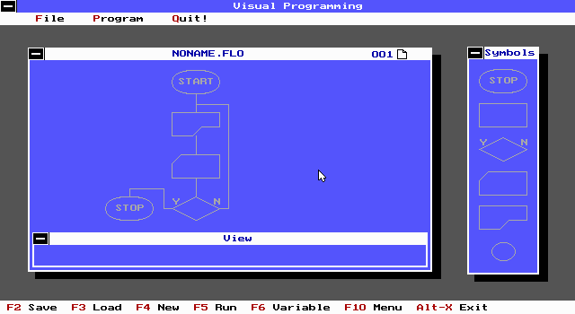

# VisualProgramming v1.01
This project was the contribution by @joenotcharles and @colinbendell for the 1995 Guelph University Software Development Contest. 

# Overview

VisaulProgramming (VP) is an IDE that utilizes flowcharts and flowchart symbols as the principle paradigm to build applications. The Object of VP was to enable early developers to utilize principles commonly taught in computing classes to build their first applications. In this way, the student can bring to life a real program that accepted input, evaluated conditional logic, assigned variables and produced output. 

In the early 1990s many high school class environments attempted to teach elementary computer science using academic tools like flowcharting. However, since the majority of teachers at the time did not have access to software development training themselves, it was difficult for students to bridge these concepts and start to develop their own programs. Recognizing this need, Visual Programming uses the familiar shapes and concepts of flowcharts and provides a GUI where the student can construct their logic and turn it into an application. This application could be executed in the IDE or transpiled into equivalent Pascal source code.

# Historical Context

## The TUI / GUI Environment

In 1994, development on Windows 3.1 was very nascent and not accessible to the authors of VP. However, the latest releases of Norton Commander and the Norton suite of tools, inspired the potential of a TUI/GUI environment within DOS 6.2's real mode.

The early iterations used a Text User Interface in VGA `mode 11`(?) which provided a 80x50 character mode and could be combined with character remapping to provide custom glyphs. This could ceate an illusion of a graphical interface but using standard text mode and avoid the complications of having multiple pages and managing sprites. However, the unforseen complication of this was the processing required to track mouse movements and dynamically redraw and push glyphs.

Using the text mode was ultimately abandonded to use a simple graphics mode (EGA Hi or 640x350 with 16colors). A shareware library was used that provided basic mouse tracking and offered a minimal set of modal APIs without having to construct a graphical object model like which was needed in the win16/win32 CTL.DLL.

In retrospect, it might have been easier to focus on windows development and adopting the windows APIs. Windows development was very nascent and required C or C++. Just adopting the Pascal's 5.5 newly introduced object and types model was enough of a mind fuck.

## Extended Memory Specification (XMS) extensions
One of the practical problems with building a DOS application was the 512K / 640K limitation. Quickly the environment needed for VP required more memory allocation to avoid the random crashing. Since the application was written in REAL mode and was strictly a text based application, the reserved EMS between 640K and 1024 could be repurposed. Unfortunately the use of EMS proved problematic because of the use of the EGA mode and a slightly more traditional approach was adopted to access the XMS memory space. 

Unfortunately XMS required x86 protected mode to access this memory space. A common work around was to use the dos 6.2+ himem.sys and emm386.sys APIs and which acted as an interrupt bridge to the larger memory space while in real mode. VP depended on these XMS DOS APIs used a common shareware library to remap pascal's operating environment with this additional memory. Again, in retrospect, it probably would have been much simpler to write this in Windows 3.1 and defer the memory management.

## Sad State of Inline Comments
One of the criteria for the computing competition was to provide all source code with complete inline documentation. At the time we assumed that inline comments were meant to teach the reader how to code and so you will see comments like `{end of if}`. Sadly, this means that most of the actual semantic meaning of the code is lost to time.

## Tabs v. Spaces
In 1995 we used tabs and spaces interchangeably -- like animals.

# Application Functionality
The application consisted of 7 basic nodes:
* **Start** (immutable and present on the first `page`)
* **Stop** to end the application flow
* **Assign** to define a variable value (and utilize current variable states) 
* **Input** to accept text input from the user and assign to a variable
* **Output** to write text to the screen, including formatted text
* **FlowControl** to jump between pages of the program. 
* **Decision** to evaluate simple logic states

## Interface
The GUI itself consisted of a tray of nodes on the right which could be dragged onto the 4x4 canvas. 

Each node could be connected to another node which would draw the necessary lines and attempt to not overlap with other flow lines. (This itself proved to be challenging as electrical engineering style `---/---` was not considered an understood concept so we had to revert to rounded hills)

Selecting any node on the canvas would reveal details of the instruction of the node. This was more relevant for assign and output operations.

Finally, the program could be saved, loaded, or run like most IDEs. As mentioned above, it also provided the ability to transpile to a simple *.pas pascal program. (And a C transpile was also prototyped but can't be found in this saved copy of the code)

While the input was assumed to be mouse driven, the environment adopted standard Borland hotkeys (F2 Save, F3 load, F5 run) and the F10 menu which was also in vogue at the time. Arrow keys could also be used to navigate around in the menu context

# Epilogue
While this programming IDE was submitted to Guelph for the compute project, I suspect we were not very good at marketing our accomplishments. Like naive early devs we assumed that our code was self evident and that the complexities of working in a simulated GUI environment but in REAL mode would be obvious. Needless to say, we did not win the competition nor did we even get an honourable mention. 

We did get a cool textbook though. 
